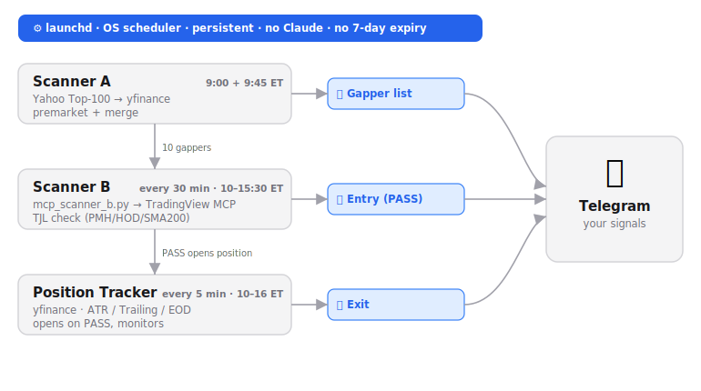

# TradingView Day-Trading Scanner — Manual

An automated US-stock day-trading scanner that finds premarket gappers, checks
them against a technical entry strategy (Trend Join Long), and monitors exits —
all delivered to your phone via Telegram.

The whole pipeline runs **autonomously on macOS via `launchd`** and needs **no
running Claude session** to operate.



---

## 1. What it does

| Stage | Script | Job |
|---|---|---|
| **Scanner A** | `daily_scanner.sh` | Finds the day's premarket gappers (Top-10) + news catalyst |
| **Scanner B** | `tjl_scanner.sh` (driven by `mcp_scanner_b.py`) | Checks each gapper for a Trend Join Long entry signal |
| **Position Tracker** | `position_tracker.py` | Opens a watched position on a PASS, sends exit alerts |

All three send Telegram messages.

---

## 2. Architecture

```
launchd (OS scheduler, persistent, survives reboot)
   │
   ├─ Scanner A ──► Yahoo Top-100 → yfinance → 10 gappers ──► Telegram (list)
   │
   ├─ Scanner B ──► mcp_scanner_b.py → TradingView MCP ──► TJL check ──► Telegram (entry/PASS)
   │                         │
   │                         └─ fallback: yfinance, if TradingView is unreachable
   │
   └─ Position Tracker ──► yfinance → ATR / trailing / EOD ──► Telegram (exit)
```

### Key design choice — direct MCP, no Claude in the loop

The TradingView MCP is a local Node stdio process
(`tradingview-mcp/src/server.js`) that talks to TradingView Desktop over the
Chrome DevTools Protocol (port 9222). `mcp_scanner_b.py` **starts that server
itself and speaks JSON-RPC to it directly** — so Scanner B gets live TradingView
data without any Claude session, API tokens, or session-expiry limits.

---

## 3. The TJL strategy (Scanner B)

A ticker **PASSES** only when **both** conditions hold:

**Daily breakout**
- current price > previous day's high, **and**
- previous day's close > SMA200 (uptrend)

**Intraday breakout**
- current price > PMH (premarket high, 4:00–9:30 ET), **and**
- current price > HOD (high of day since 9:30 ET)

This double filter rejects "fakeouts" — stocks that pop premarket but fade after
the open.

### Market-regime advisory (not a filter)

Each entry signal includes a context line — SPY & QQQ vs. their SMA200:
- 🟢 Tailwind (both above), 🟡 Mixed, 🔴 Headwind (both below — caution on longs).

It is **informational only** and never blocks a trade.

---

## 4. Exit rules (Position Tracker)

When Scanner B reports a PASS, the tracker opens a watched position and monitors:

| Exit | Trigger |
|---|---|
| Partial profit | price reaches entry + 1 ATR → take 50% |
| Trailing stop | price falls 2% below the high since entry |
| End of day | 15:45 ET → close (no overnight) |

Runs every **5 minutes**, 10:00–16:00 ET, so exit alerts arrive within ~5 min.

---

## 5. Schedule (all times auto-adjust for DST)

| Job | ET | Berlin |
|---|---|---|
| Scanner A — premarket | 9:00 | 15:00 |
| Scanner A — merge (new gappers after open) | 9:45 | 15:45 |
| Scanner B | every 30 min, 10:00–15:30 | 16:00–21:30 |
| Position Tracker | every 5 min, 10:00–16:00 | 16:00–22:00 |

**DST robustness:** EU and US switch daylight saving on different dates (≈3 weeks
a year the Berlin↔ET offset drifts by 1h). Each Scanner A `launchd` job fires at
**two** Berlin times; an ET self-gate inside the script lets only the run that
actually hits the target ET time proceed. So exactly one run lands at the right
US-market time year-round.

---

## 6. Data sources

| Source | Used by | Notes |
|---|---|---|
| Yahoo Finance (`yfinance`) | Scanner A, PMH/HOD, regime, exits | Direct HTTP, no browser |
| TradingView MCP | Scanner B (primary) | Real-time; via `mcp_scanner_b.py` |
| Benzinga (Chrome) | optional news enrichment | Needs a logged-in Chrome + Claude session |

---

## 7. Setup

1. **TradingView Desktop** running with remote debugging (`--remote-debugging-port=9222`).
2. **TradingView MCP** installed at `tradingview-mcp/` (`node`, `chrome-remote-interface`).
3. **Python 3.14** with `yfinance`, `pandas`, `requests`.
4. **`.env`** in the project root:
   ```
   TELEGRAM_BOT_TOKEN=...
   TELEGRAM_CHAT_ID=...
   ```
   > The bot token is a password — never commit it. `.env` is git-ignored.
5. **Install the `launchd` jobs** — copy the four plists from `launchd/` to
   `~/Library/LaunchAgents/` and `launchctl load` each.

---

## 8. Running manually

```bash
bash daily_scanner.sh --force            # Scanner A (premarket), bypass ET gate
bash daily_scanner.sh --merge --force    # Scanner A merge run
python3 mcp_scanner_b.py                 # Scanner B via TradingView MCP (+ yfinance fallback)
bash tjl_scanner.sh --force              # Scanner B, yfinance only
python3 position_tracker.py --force      # Exit tracker
```

`--force` bypasses the time/DST gates for testing.

---

## 9. Files

| File | Purpose |
|---|---|
| `daily_scanner.sh` | Scanner A (gappers + news + Telegram) |
| `tjl_scanner.sh` | Scanner B (TJL check + Telegram) |
| `mcp_scanner_b.py` | Drives the TradingView MCP directly (no Claude) |
| `position_tracker.py` | Exit monitoring |
| `launchd/*.plist` | The four scheduled jobs |
| `docs/pipeline.svg` | Architecture diagram |
| `backtest_tjl_amd.json` | PineScript backtest results |

---

## 10. Disclaimer

This is a **screening and alerting tool**, not a trading bot. It never places
orders and does not guarantee profits. All trade decisions are made by the
trader. The regime line and exit alerts are informational.
